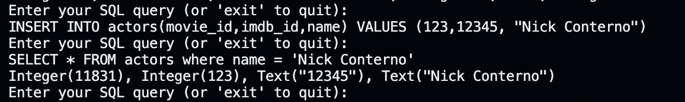
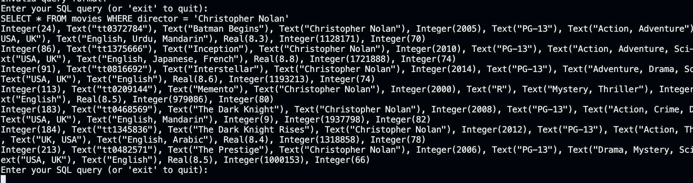
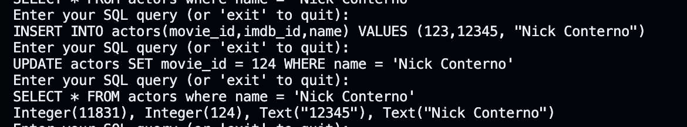
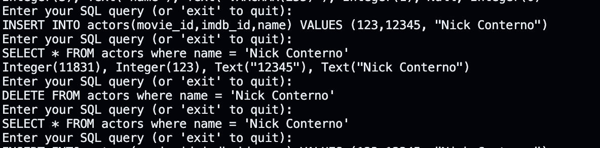
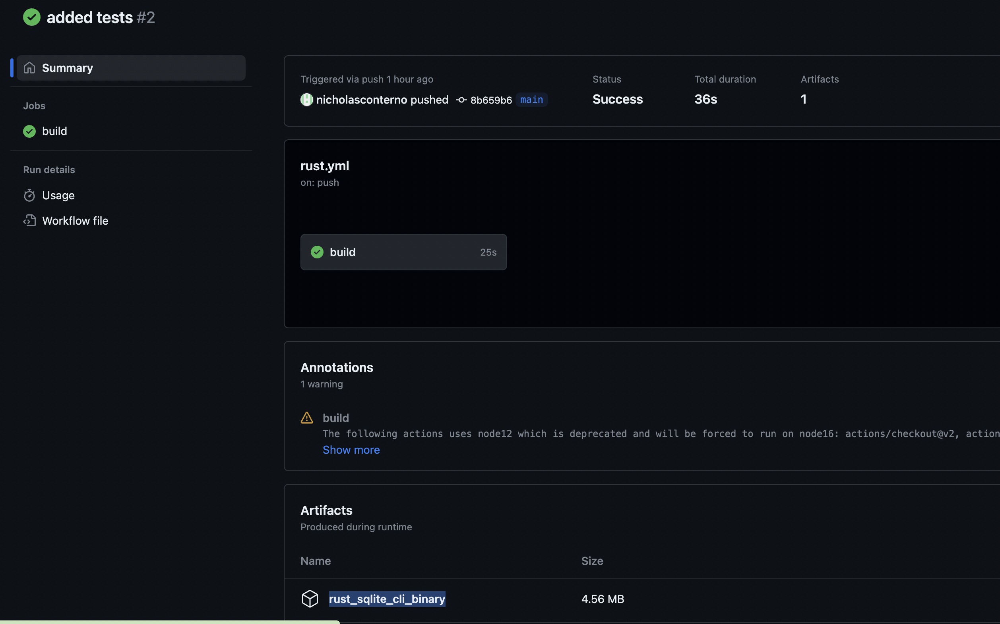

# IDSProject2Conterno

[](https://github.com/nogibjj/IDSProject2Conterno/actions/workflows/rust.yml)

### Video Demo
[Video Demo](https://www.youtube.com/watch?v=EJ0Rfpz9PmY&ab_channel=AbneyJohnson)


## Project Explanation

This project is built in rust and makes a command-line tool which allows the user to run CRUD operations on an SQLITE database.\
It includes error-handling, testing, and the unique rust feature of lifetimes. Overall, the user is able to use the program quite easily

## How to run Program
The following command will start the program and make sure we are in the correct directory:
```bash
cd rust_sqlite_cli
cargo run --release
```
After that you will see a prompt 'Enter your SQL query' as shown below
](Example.png)

You can also use 
```bash
cargo test
```
to run the rust tests, but these also automatically run anytime we push our code, via github actions.

## How to run binary (Installation and Running the Project)

1. **Clone the repository**

```bash
git clone https://github.com/nogibjj/IDSProject2Conterno
cd IDSProject2Conterno
```

2. **Build the project**

```bash
   cargo build --release
```

   This will create an optimized binary in the `target/release/` directory.

3. **Run the project**

```bash
   cargo run --release
```
4. **Alternate Method (directly running executable)**
```bash
cd target
cd release
./rust_sqlite_cli
```

## Dependencies

This project relies on the following external dependencies:

### Rust

Ensure you have Rust and Cargo (Rust's package manager) installed. If not, you can install them by following the instructions on [rustup.rs](https://rustup.rs/).

### SQLite

This project uses SQLite for database management. Ensure you have SQLite installed:

#### Ubuntu/Debian

```bash
sudo apt-get update
sudo apt-get install sqlite3 libsqlite3-dev
```

#### macOS (using Homebrew)

```bash
brew install sqlite
```

#### Windows

Visit [SQLite Download Page](https://www.sqlite.org/download.html) and download the precompiled binaries for your platform.

### Rusqlite

[Rusqlite](https://github.com/rusqlite/rusqlite) is a set of Rust bindings for SQLite. It will be automatically handled by Cargo when you build or run the project.


## Use of Github Copilot
Copilot has a great feature which allows you to tab-complete code, making development time much shorter. I used this a lot.\
I also used Copilot Chat to help me debug my rust code, as it is extremely helpful in that avenue.\
Overall, Github Copilot was a huge help in creating this project.\
Find out more here: https://github.com/features/copilot


## Error Handling

The Rust code robustly handles potential errors to ensure the application's stability and to provide meaningful feedback to users. Here's an overview of the error handling mechanisms I've integrated:

### 1. `Result` Type

Throughout the codebase, I use the Rust's built-in `Result` type for functions that might encounter errors. The `Result` type can return either an `Ok` variant, indicating success, or an `Err` variant, detailing the nature of the error.

### 2. Propagation with `?`

Instead of manually matching on every `Result` type, our code uses the `?` operator. This operator allows for cleaner code by automatically propagating errors up the call stack until they are explicitly handled.

For instance:

```rust
let conn = Connection::open("movies.db")?;
```

If `Connection::open` encounters an error, it will immediately return from the enclosing function, passing the error upwards.

### 3. User Feedback

Whenever an error occurs, especially during database operations, users are informed with a clear and concise error message, ensuring they understand the nature of the problem.

Example:

```rust
Err(e) => {
    println!("Error executing query: {}", e);
}
```

### 4. Validation Checks

To prevent invalid database queries, I've implemented basic validation checks. If a query doesn't pass these checks, a friendly "Invalid query format!" message is shown, guiding users to input valid SQL queries.

### 5. Graceful Exit

In the event of a critical error, such as failing to open the database, the application exits gracefully with a descriptive error message. This is ensured by using the `expect()` method on `Result` types for crucial operations.


## Unique Features: Lifetimes

In this project, I've made use of one of Rust's most distinctive and powerful features: lifetimes. Lifetimes ensure that our code remains memory safe without the need for a garbage collector. Here's a closer look at how I've employed lifetimes in our application:

### 1. **Definition of Lifetimes**

Lifetimes are annotations that specify how long references to data should be valid. In Rust, ensuring that references do not outlive the data they point to is crucial for preventing "dangling references", a common source of bugs in other languages.

### 2. **Function Signatures with Lifetimes**

In our code, I've explicitly annotated lifetimes in function signatures to indicate the relationship between the lifetimes of its parameters and return values. This enables the Rust compiler to verify that the references being used are valid for the intended duration.

Example:

```rust
fn validate_query_lifetime<'a>(query: &'a str) -> Option<&'a str>
```

Here, `'a` is a lifetime annotation. It tells the Rust compiler that the returned `&str` (if any) will live as long as the `query` reference passed into the function.


### 3. **Compiler Checks**

One of the strengths of lifetimes in Rust is that they're checked at compile time. This means that any misuse of references that could lead to dangling pointers or other memory safety issues are caught before the code even runs. In our project, this provides an additional layer of robustness, ensuring that the CLI tool is not just functional, but also safe.

## Demonstration of CRUD

### Create
Let's see if we can Insert a row into one of our tables, I'll use my own name so we know that it wasn't in the database initially. The SQL We will run is:

```sql
INSERT INTO actors(movie_id,imdb_id,name) VALUES (123,12345,"Nick Conterno")
```
Then we can do the following to make sure it worked:
```sql
SELECT * FROM actors where name = 'Nick Conterno'
```
We can see the results below:


### Read
Now let's make sure we can read from our database. 
We can simply check by running the following SQL command
```sql
SELECT * FROM movies WHERE director = 'Christopher Nolan'
```
The output should be all the movies Nolan has directed which are in the database, which is what we see as shown below.



### Update
Now let's prove we can update our rows.
First, let's insert the same row from before:
```sql
INSERT INTO actors(movie_id,imdb_id,name) VALUES (123,12345,"Nick Conterno")
```
Now let's update the row's movie_id:
```sql
UPDATE actors SET movie_id = 124 WHERE name = 'Nick Conterno'
```
This should have updated our row, but we can confirm with the following:
```sql
SELECT * FROM actors where name = 'Nick Conterno'
```
We can see from the image below, that the row has been updated to have 124 for the movie_id


### DELETE

Finally, let's confirm we can delete rows. 
Again, let's insert this row:
```sql
INSERT INTO actors(movie_id,imdb_id,name) VALUES (123,12345,"Nick Conterno")
```
Now let's make sure the row is there with:
```sql
SELECT * FROM actors where name = 'Nick Conterno'
```
Now we can delete the row with:
```SQL
DELETE FROM actors where name = 'Nick Conterno'
```
To confirm the row is gone we can try to read it again:
```sql
SELECT * FROM actors where name = 'Nick Conterno'
```
Notice from the output below, that nothing was outputted the second time, becuase we deleted the row.



After all of our tests, we can succesfully confirm that we have all CRUD operations in rust on our command line interface. 

### Optimized Rust Binary

Note that you can download the rust binary from github actions workflows. 
The following link has an example of a workflow, and at the bottom you will see a header 'Artifacts" where you can download the binary, in my case called 'rust_sqlite_cli_binary'

https://github.com/nogibjj/IDSProject2Conterno/actions/runs/6645601799 

At the bottom of the following image you can see the artifact ready to download. (it is highlighted)


### Github Actions
We also succesfully have implemented some github actions for this program to automatically Build, Test,and Lint our code on push.
The following shows how we do build:

```yml
 - name: Build
      run: cargo build --release
      working-directory: ./rust_sqlite_cli
```

The following is for Tests:
```yml
- name: Test
      run: cargo test
      working-directory: ./rust_sqlite_cli
```
And finally for linting:
```yml
    - name: Lint with Clippy
      run: cargo clippy -- -D warnings
      working-directory: ./rust_sqlite_cli

```
These are all present in our /.github/workflows/ folder in our .yml file, which allows our workflows to run.


